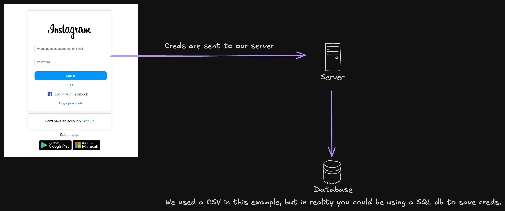

## <h3>Instagram phishing</h3>

<h6>Simple express server to logs credentials</h6>

---

---

<h4>Improvements</h4>

- Add OTP Bypass (Could be a selenium browser listening for change in the database and login automatically to send 2fa code)

<h4>Support me</h4>

- Thanks for looking at this repository, if you like to press the ⭐ button!
- Made by [imzoloft](https://github.com/imzoloft).

    <b>Informations</b> 
    
    
    
    
    

